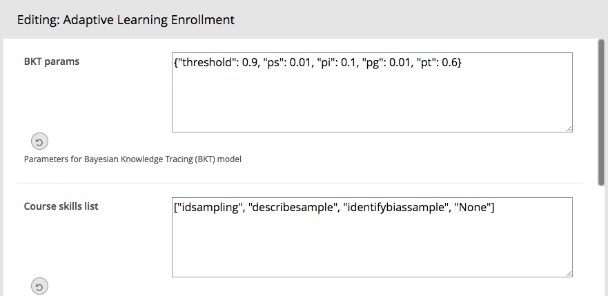
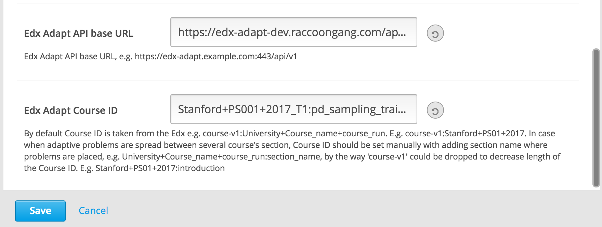

# Edx Adapt XBlock

This XBlock is a tool to configure student automatically in edx-adapt.

Place this XBlock at the beginning of your course so a student gets registered in the edx-adapt instance for a given
course before they starts to solve problems.

This XBlock does two things.

1. Lets teacher configure:
    * Edx adapt API base URL
    * Edx adapt parameters for new students
    * Edx adapt skills for new students
2. Register students in the edx adapt app once they view it in the Courseware.

## Teacher configuration fields

- **BKT params**: parameters for Bayesian Knowledge Tracing (BKT) model default one is:
`{"pi": 0.1, "pt": 0.5, "pg": 0.25, "ps": 0.25, "threshold": 0.99}`
  * *pi* - initial probability student knows the skill
  * *pt* - probability the student learns the skill if they didn’t know it already
  * *pg* - probability the student guesses correctly even if they doesn’t know the skill
  * *ps* - probability student makes a mistake even if they does know the skill
  * *threshold* - value which should be reached to make skill be set as learned

- **Course skills list**: course's skills related to every certain problem, default problems list is `["center",
"shape", "spread", "x axis", "y axis", "h to d", "d to h", "histogram", "None"]`

- **Edx Adapt API base URL**: Base URL for Edx Adapt API you're going to work with, e.g.
`https://edx-adapt.example.com:443/api/v1`. Ask your Edx Adapt provider for details.

- **Edx Adapt Course ID**: Optional parameter which is required only in the case adaptive problems is spread between 
several course's section. By default Course ID is taken from the Edx e.g. 
`course-v1:<University>+<Course_name>+<course_run>`. E.g. `course-v1:Stanford+PS01+2017`. In case when 
adaptive problems are spread between several course's section, Course ID should be set manually with adding section name 
where problems are placed, e.g. `<University>+<Course_name>+<course_run>:<section_name>`, by the way 'course-v1' could 
be dropped to decrease length of the Course ID. E.g. `Stanford+PS01+2017:introduction`.

## Student registration flow

1. Check if there's a student in edx adapt with the given anonymous_student_id. If there is, we're done.
2. If there isn't:
    1. Create new user in Edx Adapt system.
    2. Configure for this user each skill defined in **skills** field.

## Edx Adapt logic brief description

When user is registered in edx-adapt each course's skill is setup with default BKT params. During going through the 
course students answers are taken into account and changed preset parameters depends on correctness of given answers 
and calculated probability student has already learned skill (Correct Probability).

When skill's Correct Probability achieves threshold value skill set as learned and problem related for that skill is 
not proposed any more to student.
